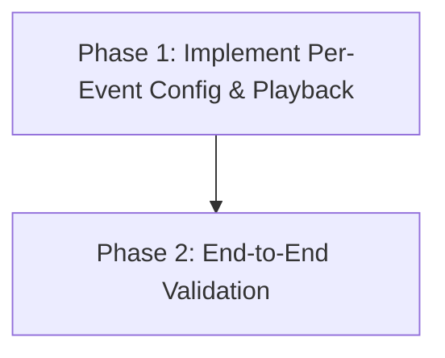

# Implementation Plan: Per-Event Custom Sound Selection

## Plan Overview
- **Total Phases:** 2
- **Agents Involved:** `coder`, `tester`
- **Estimated Effort:** Medium (2-3 hours)
- **Objective:** Modify the extension to support per-event distinct sound selection, strictly using the bundled `.wav` assets and removing macOS system sound fallback logic.

## Dependency Graph

## Execution Strategy

| Phase | Description | Agent | Execution Mode | Dependency |
|-------|-------------|-------|----------------|------------|
| 1 | Refactor TUI and Playback Script | `coder` | Sequential | None |
| 2 | End-to-End Testing | `tester` | Sequential | Phase 1 |

## Cost Estimation

| Phase | Agent | Model | Est. Input | Est. Output | Est. Cost |
|-------|-------|-------|-----------|------------|----------|
| 1 | `coder` | default | 2,500 | 1,000 | ~$0.06 |
| 2 | `tester` | default | 1,500 | 200 | ~$0.02 |
| **Total** | | | **4,000** | **1,200** | **~$0.08** |

## Phase Details

### Phase 1: Implement Per-Event Config & Playback
- **Objective**: Refactor `config-audio.js` to handle nested menus for per-event configuration (enabled state + specific sound). Migrate legacy configurations. Refactor `play-audio.sh` to extract the correct event-specific sound and remove OS-specific pathing.
- **Agent Assignment**: `coder`
  - *Rationale*: Requires complex state machine logic in Node.js and bash script modifications.
- **Files to Modify**:
  - `scripts/config-audio.js`:
    - Remove `os` requirement and `isMac` check. Hardcode `SOUNDS = ['ping1', 'ping2', 'ping3', 'ping4']`.
    - Update `readSettings` / normalization logic: if `ext.events[ev]` is boolean, convert it to `{ enabled: true/false, sound: null }`.
    - Implement a sub-menu state. When a user presses `1` (for SessionStart), show a sub-menu: 
      `[1] Toggle (Currently On)`
      `[2] Change Sound (Currently ping1)`
      `[B] Back`
    - Save the updated object structure to `settings.json`.
  - `scripts/play-audio.sh`:
    - Update inline Node script to correctly extract `eventSound` (e.g. `events[event].sound || globalSound`).
    - Remove the `/System/Library/Sounds/` fallback. All sounds must point to `$EXT_DIR/assets/sounds/${SOUND_NAME}.wav`.
  - `gemini-extension.json`:
    - Update the description of `NOTIFY_SOUND_SOUND` to remove mentions of macOS system sounds (Ping, Pop, Glass).
- **Validation Criteria**:
  - `node scripts/config-audio.js` should not crash and should show the sub-menus correctly.
- **Dependencies**:
  - `blocked_by`: None
  - `blocks`: Phase 2

### Phase 2: End-to-End Validation
- **Objective**: Verify the nested menu writes the correct object structure to `settings.json` and `play-audio.sh` plays the correct asset.
- **Agent Assignment**: `tester`
  - *Rationale*: Requires running the bash script and checking the spawned `afplay` commands.
- **Validation Criteria**:
  - Modify `settings.json` so `SessionStart` has sound `ping3` and `SessionEnd` has sound `ping4`.
  - Run `bash scripts/play-audio.sh SessionStart` and verify `afplay .../assets/sounds/ping3.wav` is spawned.
  - Run `bash scripts/play-audio.sh SessionEnd` and verify `ping4.wav` is spawned.
  - Run `bash scripts/play-audio.sh Notification` (which has no specific sound) and verify it falls back to the global sound (`ping1.wav`).
- **Dependencies**:
  - `blocked_by`: Phase 1
  - `blocks`: None

## Execution Profile
- Total phases: 2
- Parallelizable phases: 0
- Sequential-only phases: 2
- Estimated sequential wall time: 10 minutes

Note: Parallel dispatch runs agents in autonomous mode (--approval-mode=yolo). All tool calls are auto-approved without user confirmation.