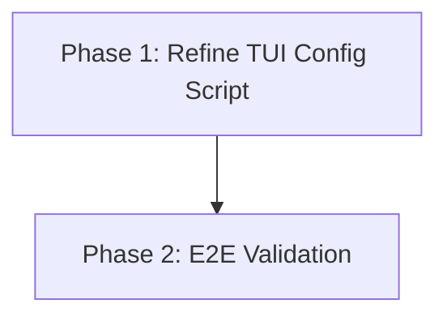

# Implementation Plan: Notify Sound TUI Enhancement

## Plan Overview
- **Total Phases:** 2
- **Agents Involved:** `coder`, `tester`
- **Estimated Effort:** Low (1-2 hours)
- **Objective:** Refine the existing `readline` TUI in `config-audio.js` to reliably toggle specific Gemini CLI hook events and ensure `play-audio.sh` respects these granular settings.

## Dependency Graph

## Execution Strategy

| Phase | Description | Agent | Execution Mode | Dependency |
|-------|-------------|-------|----------------|------------|
| 1 | Refine `config-audio.js` and verify `play-audio.sh` | `coder` | Sequential | None |
| 2 | End-to-End Testing | `tester` | Sequential | Phase 1 |

## Cost Estimation

| Phase | Agent | Model | Est. Input | Est. Output | Est. Cost |
|-------|-------|-------|-----------|------------|----------|
| 1 | `coder` | default | 1,500 | 300 | ~$0.03 |
| 2 | `tester` | default | 1,000 | 100 | ~$0.01 |
| **Total** | | | **2,500** | **400** | **~$0.04** |

## Phase Details

### Phase 1: Refine TUI Config Script
- **Objective**: Ensure `config-audio.js` correctly renders the toggle menu for all valid events, robustly handles user input, and saves the specific event states properly to `~/.gemini/settings.json`. Verify that `play-audio.sh` correctly reads these specific states.
- **Agent Assignment**: `coder`
  - *Rationale*: Requires modifying the Node.js readline implementation and bash script logic.
- **Files to Modify**:
  - `scripts/config-audio.js`:
    - Ensure `EVENTS` array exactly matches the expected Gemini CLI hooks.
    - Improve error handling around saving.
    - Ensure the display distinguishes clearly between enabled/disabled states for each event.
  - `scripts/play-audio.sh`:
    - Review the inline Node.js parsing logic to ensure `ext.events['$EVENT'] !== false` is correctly evaluated and short-circuits the script if false.
- **Implementation Details**:
  - The TUI logic in `config-audio.js` mostly exists. The coder needs to review it to ensure that when a user types a number (e.g., '1' for SessionStart), the corresponding boolean in `ext.events['SessionStart']` is toggled and saved.
  - The bash script uses `node -e` to extract the JSON values. Ensure the fallback logic works perfectly so it doesn't break if `events` is undefined.
- **Validation Criteria**:
  - Run `node scripts/config-audio.js` manually to ensure it doesn't crash on startup.
- **Dependencies**:
  - `blocked_by`: None
  - `blocks`: Phase 2

### Phase 2: End-to-End Validation
- **Objective**: Verify that toggling an event in the TUI actually stops the sound for that specific event, while the master switch and other events continue to work.
- **Agent Assignment**: `tester`
  - *Rationale*: Requires running the shell commands and validating the output/behavior.
- **Validation Criteria**:
  - Execute `bash scripts/play-audio.sh PreCompress` while `PreCompress` is enabled -> should play sound (or at least exit 0 normally without short-circuiting).
  - Modify `settings.json` to disable `PreCompress`.
  - Execute `bash scripts/play-audio.sh PreCompress` -> should short-circuit and exit immediately.
- **Dependencies**:
  - `blocked_by`: Phase 1
  - `blocks`: None

## Execution Profile
- Total phases: 2
- Parallelizable phases: 0
- Sequential-only phases: 2
- Estimated sequential wall time: 5 minutes

Note: Parallel dispatch runs agents in autonomous mode (--approval-mode=yolo). All tool calls are auto-approved without user confirmation.